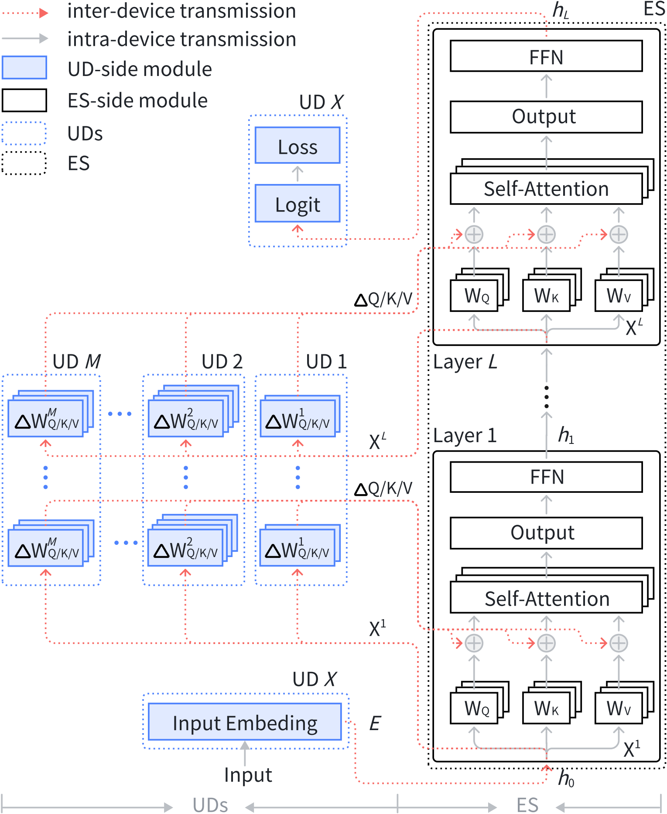
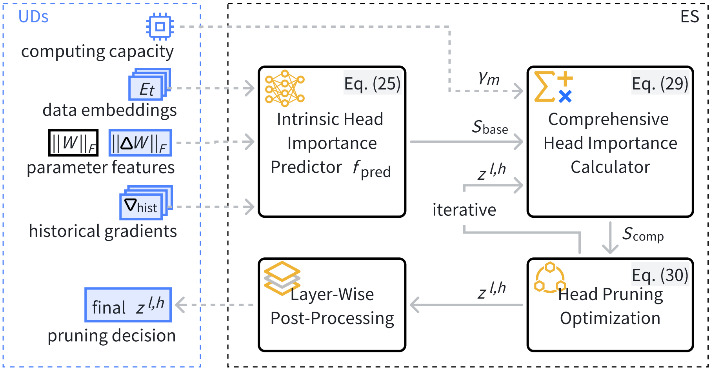
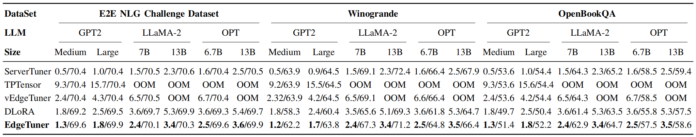

# EdgeTuner
EdgeTuner: Collaborative Edge Fine-Tuning of LoRA-based LLMs via Importance-Aware Head Pruning

## Abstract:
The rapid proliferation of large language models (LLMs) has driven the demand for personalized applications in domains such as intelligent assistants and healthcare analytics. While parameter-efficient fine-tuning techniques such as low-rank adaptation (LoRA) have made model customization more tractable, their practical deployment at the network edge still faces significant challenges. On one hand, federated learning requires each user device to host the full base model, exceeding device resource constraints. On the other hand, split learning, although privacy-preserving, incurs heavy communication overhead due to the frequent transmission of high-dimensional intermediate states. To overcome these limitations, we propose **EdgeTuner**, a collaborative architecture that hosts the base model on an edge server (ES) and partitions lightweight LoRA module heads across user devices (UDs), achieving both resource balancing and privacy preservation. Motivated by the empirical observation that many attention heads contribute minimally for each sample, we further introduce **iHeadPruner**, a dynamic, importance-aware pruning mechanism that leverages gradient, parameter, and embedding statistics to selectively skip unimportant heads during training, significantly reducing communication volume without compromising model performance. Experiments on a realistic testbed with state-of-the-art LLMs demonstrate that EdgeTuner substantially accelerates fine-tuning while maintaining strong accuracy and robustness.

## Method:
<p align="center">

</p>
System architecture of EdgeTuner, consisting of one ES (*right*, hosting the base model) and $M$ UDs (_left_, each holding LoRA modules for fine-tuning). The input and output layers of the LLM can reside on any client UDs, reducing the exposure risk of user-private data and modules. As inter-device transmission (red dashed lines) incurs significantly higher latency than intra-device transmission (grey solid lines), EdgeTuner is designed to minimize inter-device communication. For clarity, the backward gradient flow, opposite to the depicted state flow, is omitted from the figure.

<p align="center">

</p>
Workflow of iHeadPruner, which is deployed on the ES
and designed for computational efficiency. Notably, the pruner only
requires one additional UD→ES transmission of parameter features
(the data embeddings and historical gradients can be reused from
the fine-tuning step transmission) and an ES→UD transmission of
pruning decisions, thus is also communication-efficient.


## Experiment:
<p align="center">

</p>
Performance comparison of baselines across LLMs and datasets. Each result is reported in Lat/Acc, measured by s and %, respectively.

## Usage:

1. Download model checkpoints and datasets
```
cd example/NLG/
bash download_pretrained_checkpoints.sh
bash create_datasets.sh
cd ./eval
bash download_evalscript.sh
cd ..
```

2. run EdgeTuner code
```
cd src/
python opt_pred_model_encoder.py # train iHeadPruner
cd ..
bash run_edge_tuner_code.sh # finetuning by EdgeTuner
```

3. Generate outputs from the trained model using beam search:
```
bash generate_edge_tuner_output.sh
```

4. Decode outputs from step (3)
```
bash decoder_edge_tuner_output.sh
```

5. Run evaluation on E2E test set

```
python eval/e2e/measure_scores.py e2e_ref.txt e2e_pred.txt -p
```